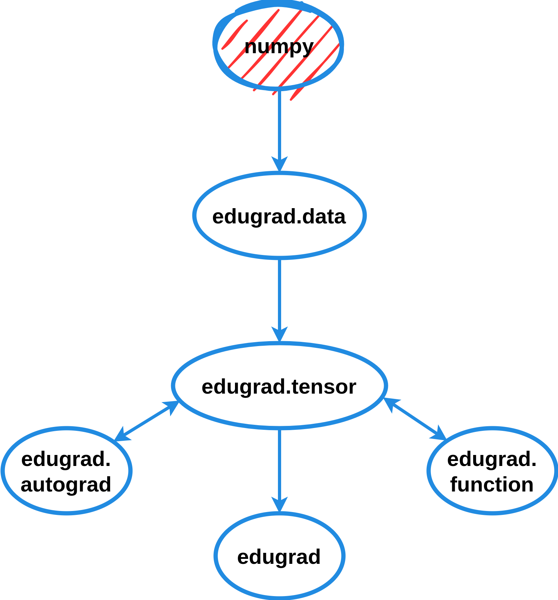

**edugrad** is the most simple and accesible implementation of a deep learning framework. Its purpose is to reveal the
core components of such libraries, explaining their functionality and underlying programming principles.

## Key Features

- **Autograd Mechanism**: Features an automatic differentiation system for computing gradients, vital for training
  various types of neural networks within a single framework.
- **Tensor Operations**: Implements a tensor class enabling fundamental matrix operations crucial for neural network
  computations, with numpy as the backend.
- **Simple Interface**: Provides an API that mirrors PyTorch, making edugrad easy to use.
- **Educational Code**: The code style and module structure are designed for ease of understanding, both
  programmatically and conceptually.

Please note that while edugrad theoretically supports the implementation of any neural network model, it lacks the
memory and computational optimizations found in more advanced frameworks. This design choice maximizes code readability
but limits the framework's capability to smaller models.


## Example

## Credits

Starting point of this project is George Hotz' [tinygrad](https://github.com/tinygrad/tinygrad/tree/master), see
[license](https://github.com/tostenzel/edugrad/blob/24-write-readmemd-with-implementation-details/LICENSE). I removed
features that did not align with edugrad's purpose, eliminated all optimizations, and adjusted the module structures and
coding style, adding extensive explanations in docstrings and comments. The changes and additions to the code are
relatively minor. The autograd mechanism is inspired by Andrej Karpathy's
[micrograd](https://github.com/karpathy/micrograd).

## Code Structure
<p align="center">

</p>


## Conceptual Explanations

## Installation

```
git clone https://github.com/tostenzel/edugrad
cd edugrad
```

Set up environment in `edugrad/.env` and install requirements with conda from `environment.yaml`:

```
conda create --prefix .env
conda activate .env/
conda env update --file environment.yaml --prefix .env
```

Install edugrad from source in editable mode to enable absolute imports:

```
pip install -e .
```

Verify installation:

```
python applications/learn_mnist.py
```
