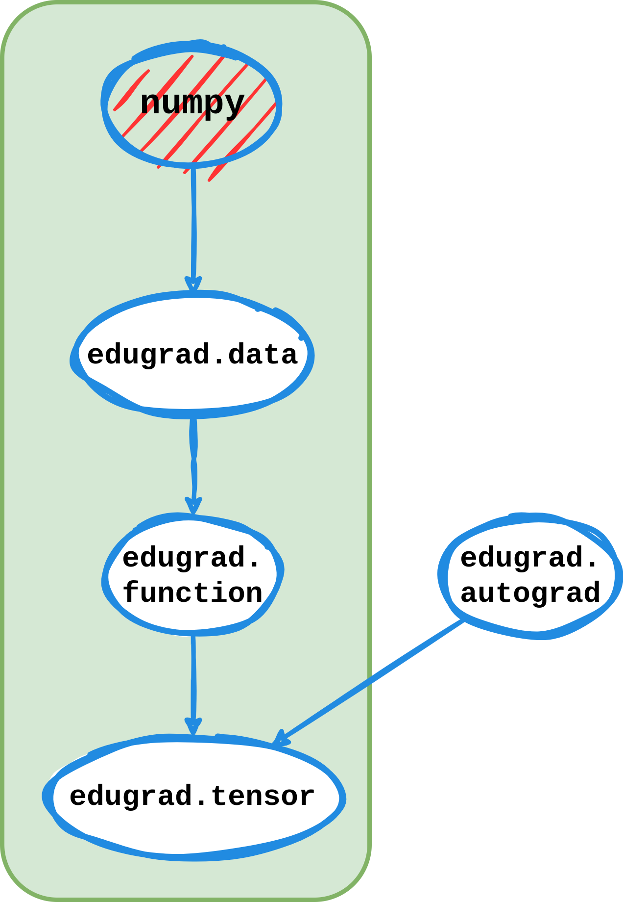

<p align="center">

</p>

**edugrad** is a simple and accesible implementation of a deep learning framework. Its purpose is to reveal the
core components of such libraries.

Unlike other educational packages, edugrad supports a powerful tensor (n-dimensional matrix) class that can be used to implement modern neural networks. One lesson is how extensive this class is.


## Key Features

- **Autograd Mechanism**: Features an automatic differentiation system for computing gradients, vital for training
  various types of neural networks within a single framework.
- **Tensor Operations**: Implements a tensor class enabling fundamental matrix operations crucial for neural network
  computations, with numpy as the backend.
- **Simple Interface**: Provides an API that mirrors PyTorch, making edugrad easy to use.
- **Educational Code**: The code style and module structure are designed for ease of understanding, both
  programmatically and conceptually.

Please note that while edugrad theoretically supports the implementation of any neural network model, it lacks the
memory and computational optimizations found in more advanced frameworks. This design choice maximizes code readability
but limits the framework's capability to smaller models.


## Example


## The Code

In this section we look at how the code implements i.) the tensor operations and ii.) the autograd mechanism.

- [Low-level, Mid-level and High-level Operations](#iow-level-mid-level-and-high-level-operations)
- [Computational Graphs in Forward and Backward Passes](#computational-graphs-in-forward-and-backward-passes)

<p align="center">

</p>

### Low-level, Mid-level and High-level Operations

The computation processes are structured across different levels of operations, namely low-level (`data.py`), mid-level (`function.py`) and high-level (`tensor.py`)operations. 

#### 1. Low-Level Operations
- **Module**: `data.py` (`TensorData` class)
- **Purpose**: Execution of most basic tensor operations.
- **Characteristics**:
  - Implement elemental tensor operations like addition, multiplication, reshaping, etc.
  - Immediate execution of operations using CPU, leveraging `numpy.array`'s capabilities. Using a different backend like PyTorch or Jax would only require reimpleneting 17 operations in the module (enumerated in `ops.py`).
  - Operations at this level do not involve gradient computations or the autograd mechanism.
  - Acts as the foundational building block for higher-level operations.

#### 2. Mid-Level Operations
- **Module**: `function.py` (`Function` class and its subclasses)
- **Purpose**: Define differentiable functions that include both forward and backward computation logic.
- **Characteristics**:
  - Compose low-level ops from `data.py` to define more complex operations.
  - Each operation (e.g., `Add`, `Mul`, `Sin`) encapsulates a forward pass and a corresponding backward pass for gradient computation.
  - Serves as the backbone of edugrad's autograd system, allowing for automatic differentiation of different models defined with `edugrad.Tensor`.
  - Mid-level operations are used as nodes to build complex computational graphs during the forward pass, storing necessary information for the backward pass.

#### 3. High-Level Operations
- **Module**: `tensor.py` (`Tensor` class)
- **Purpose**: Provide a user-friendly interface for tensor operations and enable building and training neural network models.
- **Characteristics**:
  - High-level abstraction for tensor operations.
  - Utilizes mid-level ops from `function.py` to implement tensor methods and matrix algebra, enabling automatic differentiation without defining a backward function.
  - Includes a broad range of operations commonly used in neural networks, like matrix multiplication, activation functions, and loss functions.
  - Facilitates the construction and manipulation of larger computational graphs through tensor operations.
  - This level is where most users interact with the edugrad library, building and training models using a familiar, PyTorch-like API.

<p align="center">

</p>

### Computational Graphs in Forward and Backward Passes

In edugrad, the handling of the computational graph, particularly the relationships between nodes (tensors) during the forward and backward passes, is crucial for understanding how automatic differentiation works. Let's delve into the details of how the parents of each node are stored in `Tensor._ctx` and how they are utilized during the backward pass by functions in `autograd.py`.

#### Forward Pass: Storing Parent Nodes

During the forward pass, when operations are performed on tensors, new tensors are created as a result of these operations. Each new tensor maintains a reference to its "parent" tensors – the tensors that were used to compute it. This reference is stored in a special attribute called `_ctx`.

##### _ctx Attribute:

- When an operation is performed on one or more tensors, an instance of the corresponding `Function` class (from `function.py`) is created. This instance represents the operation itself.
- The `_ctx` attribute of the resultant tensor is set to this instance. It effectively becomes a context that encapsulates the operation and its input tensors.
- The `Function` instance (context) stores the input tensors as parents. These are the tensors whose attributes were used to calculate the resultant tensor.

##### Example of Forward Pass

Consider an operation `z = x + y`, where `x` and `y` are tensors. The `Add` function from `function.py` is used:

```python
class Add(Function):
    def forward(self, x: TensorData, y: TensorData) -> TensorData:
        return x.elementwise(ops.BinaryOps.ADD, y)

    def backward(self, grad_output: TensorData) -> Tuple[Optional[TensorData], Optional[TensorData]]:
        return grad_output if self.needs_input_grad[0] else None, grad_output if self.needs_input_grad[1] else None
```

When z is computed:

```python
z = x + y  # Internally calls Add.apply(x, y)
```

`z._ctx` is set to an instance of `Add`, and this instance stores `x` and `y` as its parents.

#### Backward Pass: Utilizing Parent Nodes

During the backward pass, gradients are computed in reverse order, starting from the final output tensor and propagating through its ancestors.

#### Backward Function in autograd.py:
- When `backward()` is called on the final output tensor, usually the cost/loss, `autograd.ollect_backward_graph()` starts traversing the computational graph in reverse.
- It begins with the tensor on which `backward()` was called and recursively visits the parent tensors stored in `_ctx`.

#### Gradient Computation:
- At each tensor, `backward()` calculates the gradient of the tensor with respect to each of its parents. This is done using the `backward` method of the `Function` instance stored in `_ctx`.
- The gradients are then propagated to each parent tensor, where the process repeats.
- If a parent tensor contributes to multiple children, its gradient is accumulated from each child.

#### Example of Backward Pass

Continuing with the `z = x + y` example:

```python
z.backward()
```

This call initiates the backward pass:

- It computes the gradient of `z` (let's call it `dz`) and sets `z.grad` to `dz`.
- Then, it uses `z._ctx` (which is an instance of `Add`) to compute the gradients with respect to `x` and `y` (`dx` and `dy`).
- These gradients are then assigned to `x.grad` and `y.grad`.

#### Summary

The essence of edugrad's approach lies in how it builds and navigates the computational graph:

- **Forward Pass**: Stores parent tensors in `_ctx` of each resultant tensor, encapsulating the operation and its inputs.
- **Backward Pass**: Traverses the graph in reverse, using `_ctx` to access parent tensors (parent in forward pass direction) and compute gradients recursively. This elegantly ties together the chain of computations and their gradients, enabling efficient automatic differentiation.


## Installation

```
git clone https://github.com/tostenzel/edugrad
cd edugrad
```

Set up environment in `edugrad/.env` and install requirements with conda from `environment.yaml`:

```
conda create --prefix .env
conda activate .env/
conda env update --file environment.yaml --prefix .env
```

Install edugrad from source in editable mode to enable absolute imports:

```
pip install -e .
```

Verify installation:

```
python applications/learn_mnist.py
```

## Example

## The Code

In this section we look at how the code implements i.) the autograd mechanism and ii.) the tensor operations.

- [I. Computational Graphs in edugrad: Forward and Backward Passes](#ii-computational-graphs-in-edugrad-forward-and-backward-passes)
- [II. Low-level (`data.py`), Mid-level (`function.py`) and High-level (`tensor.py`) Operations](#i-low-level-data.py-mid-level-function.py-and-high-level-tensor.py-operations)

<p align="center">

</p>


### I. Computational Graphs in edugrad: Forward and Backward Passes

In edugrad, the handling of the computational graph, particularly the relationships between nodes (tensors) during the forward and backward passes, is crucial for understanding how automatic differentiation works. Let's delve into the details of how the parents of each node are stored in `Tensor._ctx` and how they are utilized during the backward pass by functions in `autograd.py`.

#### Forward Pass: Storing Parent Nodes

During the forward pass, when operations are performed on tensors, new tensors are created as a result of these operations. Each new tensor maintains a reference to its "parent" tensors – the tensors that were used to compute it. This reference is stored in a special attribute called `_ctx`.

##### _ctx Attribute:

- When an operation is performed on one or more tensors, an instance of the corresponding `Function` class (from `function.py`) is created. This instance represents the operation itself.
- The `_ctx` attribute of the resultant tensor is set to this instance. It effectively becomes a context that encapsulates the operation and its input tensors.
- The `Function` instance (context) stores the input tensors as parents. These are the tensors whose attributes were used to calculate the resultant tensor.

##### Example of Forward Pass

Consider an operation `z = x + y`, where `x` and `y` are tensors. The `Add` function from `function.py` is used:

```python
class Add(Function):
    def forward(self, x: TensorData, y: TensorData) -> TensorData:
        return x.elementwise(ops.BinaryOps.ADD, y)

    def backward(self, grad_output: TensorData) -> Tuple[Optional[TensorData], Optional[TensorData]]:
        return grad_output if self.needs_input_grad[0] else None, grad_output if self.needs_input_grad[1] else None
```

When z is computed:

```python
z = x + y  # Internally calls Add.apply(x, y)
```

`z._ctx` is set to an instance of `Add`, and this instance stores `x` and `y` as its parents.

#### Backward Pass: Utilizing Parent Nodes

During the backward pass, gradients are computed in reverse order, starting from the final output tensor and propagating through its ancestors.

#### Backward Function in autograd.py:
- When `backward()` is called on the final output tensor, usually the cost/loss, `autograd.collect_backward_graph()` starts traversing the computational graph in reverse.
- It begins with the tensor on which `backward()` was called and recursively visits the parent tensors stored in `_ctx`.

#### Gradient Computation:
- At each tensor, `backward()` calculates the gradient of the tensor with respect to each of its parents. This is done using the `backward` method of the `Function` instance stored in `_ctx`.
- The gradients are then propagated to each parent tensor, where the process repeats.
- If a parent tensor contributes to multiple children, its gradient is accumulated from each child.

#### Example of Backward Pass

Continuing with the `z = x + y` example:

```python
z.backward()
```

This call initiates the backward pass:

- It computes the gradient of `z` (let's call it `dz`) and sets `z.grad` to `dz`.
- Then, it uses `z._ctx` (which is an instance of `Add`) to compute the gradients with respect to `x` and `y` (`dx` and `dy`).
- These gradients are then assigned to `x.grad` and `y.grad`.

#### Summary

The essence of edugrad's approach lies in how it builds and navigates the computational graph:

- **Forward Pass**: Stores parent tensors in `_ctx` of each resultant tensor, encapsulating the operation and its inputs.
- **Backward Pass**: Traverses the graph in reverse, using `_ctx` to access parent tensors (parent in forward pass direction) and compute gradients recursively. This elegantly ties together the chain of computations and their gradients, enabling efficient automatic differentiation.


<p align="center">

</p>


### II. Low-level (`data.py`), Mid-level (`function.py`) and High-level (`tensor.py`) Operations

The computation processes are structured across different levels of operations, namely low-level, mid-level, and high-level operations. 

#### 1. Low-Level Operations
- **Module**: `data.py` (`TensorData` class)
- **Purpose**: Execution of most basic tensor operations.
- **Characteristics**:
  - Implement elemental tensor operations like addition, multiplication, reshaping, etc.
  - Immediate execution of operations using CPU, leveraging `numpy.array`'s capabilities. Using a different backend like PyTorch or Jax would only require reimpleneting 17 operations in the module (enumerated in `ops.py`).
  - Operations at this level do not involve gradient computations or the autograd mechanism.
  - Acts as the foundational building block for higher-level operations.

#### 2. Mid-Level Operations
- **Module**: `function.py` (Function class and its subclasses)
- **Purpose**: Define differentiable functions that include both forward and backward computation logic.
- **Characteristics**:
  - Compose low-level ops from `data.py` to define more complex operations.
  - Each operation (e.g., `Add`, `Mul`, `Sin`) encapsulates a forward pass and a corresponding backward pass for gradient computation.
  - Serves as the backbone of edugrad's autograd system, allowing for automatic differentiation of different models defined with `edugrad.Tensor`.
  - Mid-level operations are used as nodes to build complex computational graphs during the forward pass, storing necessary information for the backward pass.

#### 3. High-Level Operations (High-Level Ops)
- **Module**: `tensor.py` (`Tensor` class)
- **Purpose**: Provide a user-friendly interface for tensor operations and enable building and training neural network models.
- **Characteristics**:
  - High-level abstraction for tensor operations.
  - Utilizes mid-level ops from `function.py` to implement tensor methods and matrix algebra, enabling automatic differentiation without defining a backward function.
  - Includes a broad range of operations commonly used in neural networks, like matrix multiplication, activation functions, and loss functions.
  - Facilitates the construction and manipulation of larger computational graphs through tensor operations.
  - This level is where most users interact with the edugrad library, building and training models using a familiar, PyTorch-like API.


## Credits

Starting point of this project is George Hotz' [tinygrad](https://github.com/tinygrad/tinygrad/tree/master), see
[license](https://github.com/tostenzel/edugrad/blob/24-write-readmemd-with-implementation-details/LICENSE). I removed
features that did not align with edugrad's purpose, eliminated all optimizations, and adjusted the module structures and
coding style, adding extensive explanations in docstrings and comments. My changes and additions to the shortened and refactored code are
relatively minor. The autograd mechanism is inspired by Andrej Karpathy's
[micrograd](https://github.com/karpathy/micrograd).


## Deep Learning Blog

edugrad is complemented by my Deep Learning Blog Series @ [tobiasstenzel.com/blog](https://www.tobiasstenzel.com/blog/tag/dl-fundamentals/) that explains the fundamental concepts of deep learning including backpropagation and automatic reverse-mode differentiation.
